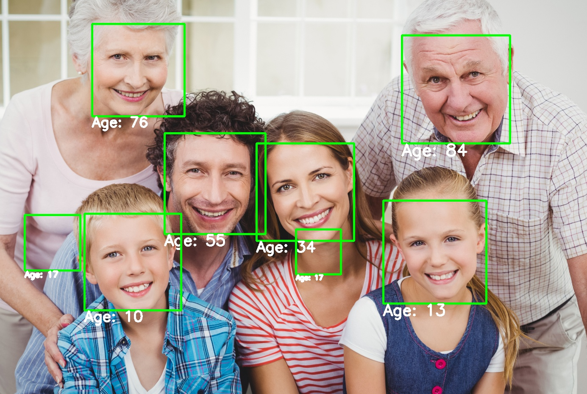
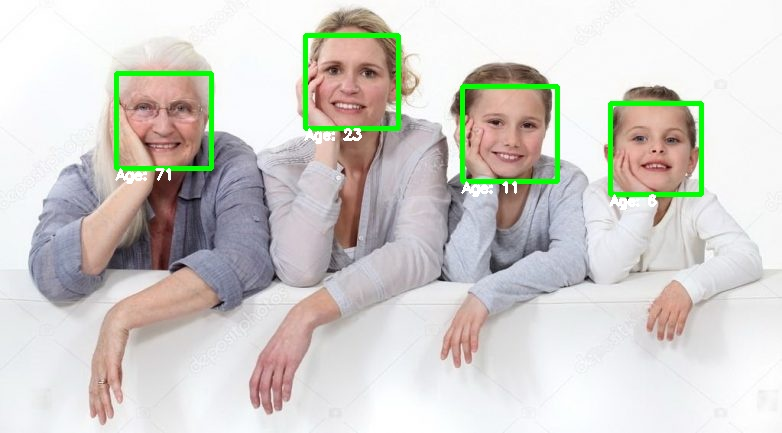
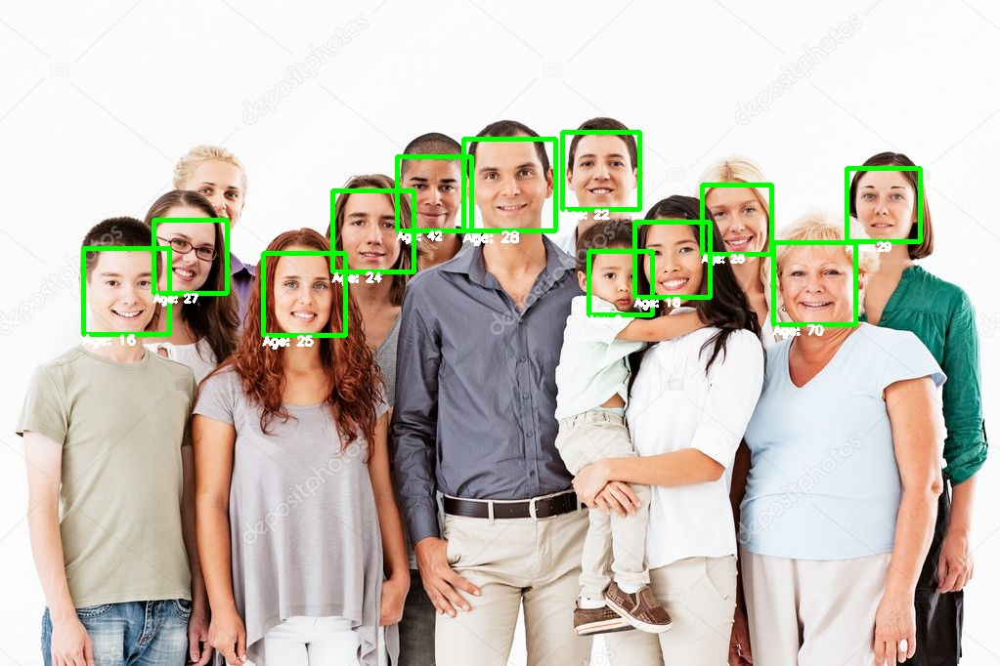
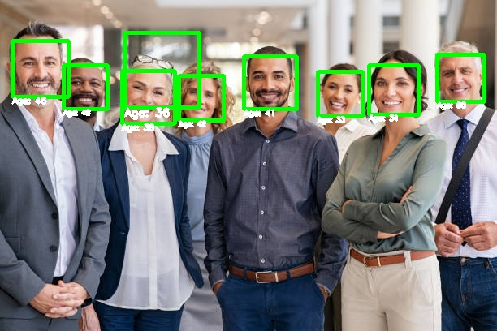

# Веб-приложение для детектирования лиц и определения возраста


Задача — собрать докеризированный сервис на FastAPI, который детектирует
лица и определяет возраст. Решена в рамках тестового задания в июле 2023 года.

### Репозиторий содержит
- Код с обучением и замером метрик `train/train.py`
- Приложение на FastAPI `app/app.py`
- Модель-класс для предсказаний `ml/Predictor.py`
- Простой пример для работы через python `client.py`

### Решения

- Детектирование лиц реализовано с помощью каскада Хаара — классического алгоритма CV.
Поскольку задача решалась в сжатые сроки, был выбран этот метод, который, кроме прочего,
отличается высокой скоростью вычислений. В другом случае задачу можно было бы решить,
к примеру, с помощью предобученной YOLOv5.
- Задача определения возраста решена как задача регрессии с использованием модели
классификации EfficientNet с одномерным выходом. Был дан датасет,
содержащий 20 000 изображений 200х200 с лицами, для которых указан возраст. 
Модель обучалась с помощью Google Colab и прекратила обучение на значении _**MSE = 60**_ на тествоом множестве.
Это означает, что в среднем модель ошибается в среднем на 7-8 лет, что кажется приемлемым
для начального приближения.

### Инструкция по загрузке весов модели, определяющей возраст
1. Скачайте [файл](https://drive.google.com/file/d/1x-FHlJgvGXIFQXkYSGaIzWylcNWpAj6a/view?usp=sharing), содержащий
веса — 2.EfficientNetB5-60.5.pth — c Google Drive
2. Поместите файл в папку `ml/age_estimation/weights/`

### Запуск приложения в докер-контейнере
```
docker build -t face_p-app .
docker run -p 80:80 face_p-app
```

### Работа с приложением
Запрос с помощью **curl**  в терминале:
```
curl -X POST -F "image=@img.jpg" http://localhost:80/predict
```
### Возвращаемый формат

Приложение возвращает список прямоугольников в формате JSON.
Каждый прямоугольник представляет собой словарь с атрибутами:
- `x1, y1`: Абсолютные координаты верхнего левого угла прямоугольника
- `width`: Ширина прямоугольника
- `height`: Высота прямоугольника
- `age`: Возраст, согласно оценке модели


### Что можно улучшить
#### Общее
- Предлагаемое базовое решение не предполагает использования видеокарты и собирается без CUDA,
что замедляет работу приложения.
- Необходимо более глубокое исследование того, какие модели следует использовать для
предсказания возраста и каким образом ставить задачу — регрессии или классификации.
- Расширить возможности модели для работы с видео. Потребуется реализовать отслеживание лиц:
это позволит обнаруживать лицо и определять возраст не для каждого кадра.
- Выгрузить и использовать веса модели в другом формате для более эффективного использрвания,
например, в onnx.
#### Детектирование лиц
- Каскад Хаара — простой и быстрый метод для детектирования лиц —
может иметь ограниченную точность при обнаружении лиц на сложных фотографиях с разными условиями освещения,
маскировкой или поворотами лиц. Его следовало бы заменить более надежной моделью глубокого обучения.
В рамках предлагаемого решения проблема поворота головы решалась путем аугментации.
#### Определение возраста
- Рассмотреть другие метрики оценки качества
- Во время обучения модели вычислять размер батча, который поместится в память
- Добавить раннюю остановку в случае преодоления момета, после которого начинается переобучение
- Использовать техники аугментации, изменяющие, например, освещение

### Примеры изображений
полученных с помощью client.py







